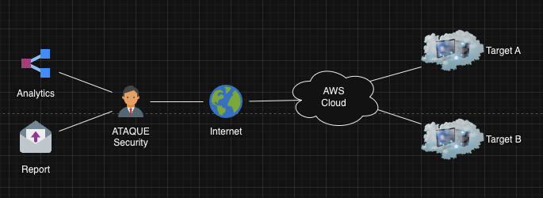
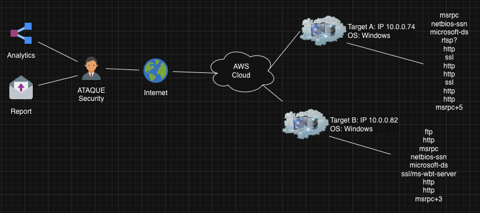
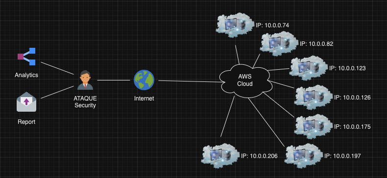

🎥 **ATAQUE Security: Dive into Our Presentations** 📊

Welcome to the nerve center of ATAQUE Security's visual storytelling. Here, we translate our complex operations, findings, and insights into compelling presentations that not only inform but also captivate.

---

**📌 Repository Overview:**

**Why Presentations?**
In the realm of cybersecurity, understanding is half the battle. Through our slideshows and video recordings, we aim to make our adversary emulation tactics, strategies, and outcomes accessible and comprehensible for everyone, from seasoned professionals to those new to the domain.

---

**🎬 Featured Content:**

1. **[Project Presentation - Slideshow](https://docs.google.com/presentation/d/1U0U4HkPjTmjLndgIuii9MQT_2FryvEBxZkBfMfatCgU/edit?usp=sharing)**
   Delve deep into our graphical representation, where each slide is a chapter of our journey, outlining our methodologies, discoveries, and recommendations.

2. **[Project Presentation - Final Video](link-to-video-recording)**
   Experience our operations come to life. Watch our team in action, narrating the intricacies of our engagement, backed by real-time visuals and demonstrations.

---

**🔍 Explore & Engage:**
Beyond just viewing, we encourage discussions, questions, and feedback. If a slide or a segment sparks your interest, or if you have suggestions for improvement, don't hesitate to reach out. Collaboration fuels our growth, and your perspective is a valuable part of that.

Thank you for joining us in this visual exploration of ATAQUE Security's endeavors.

 

### Network Topology

<!--  -->

<!--  -->

 

| Repositories | Project Management | Presentations |
|:----------------------:|:-----------------------:|:----------------------:|
| [Documentation](https://github.com/ATAQUE-Security/Documentation) | [Trello Board](https://trello.com/b/q4cb2rJl/401d8rt1) | [Slideshow](https://docs.google.com/presentation/d/1U0U4HkPjTmjLndgIuii9MQT_2FryvEBxZkBfMfatCgU/edit?usp=sharing) |
| [Presentations](https://github.com/ATAQUE-Security/Presentations) | | [Video]() |
| [Scripts](https://github.com/ATAQUE-Security/Scripts) | | |
